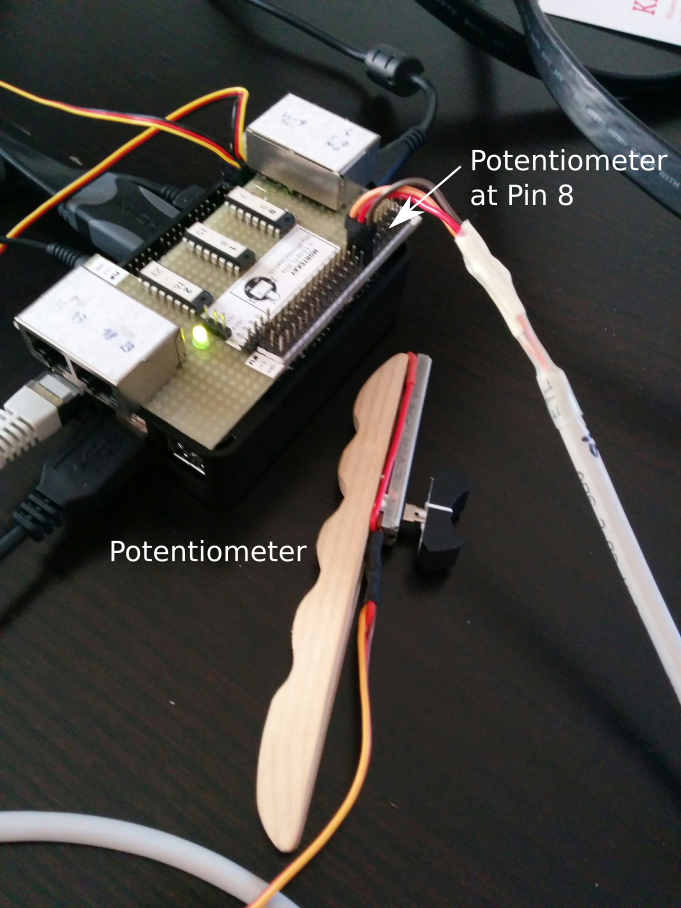
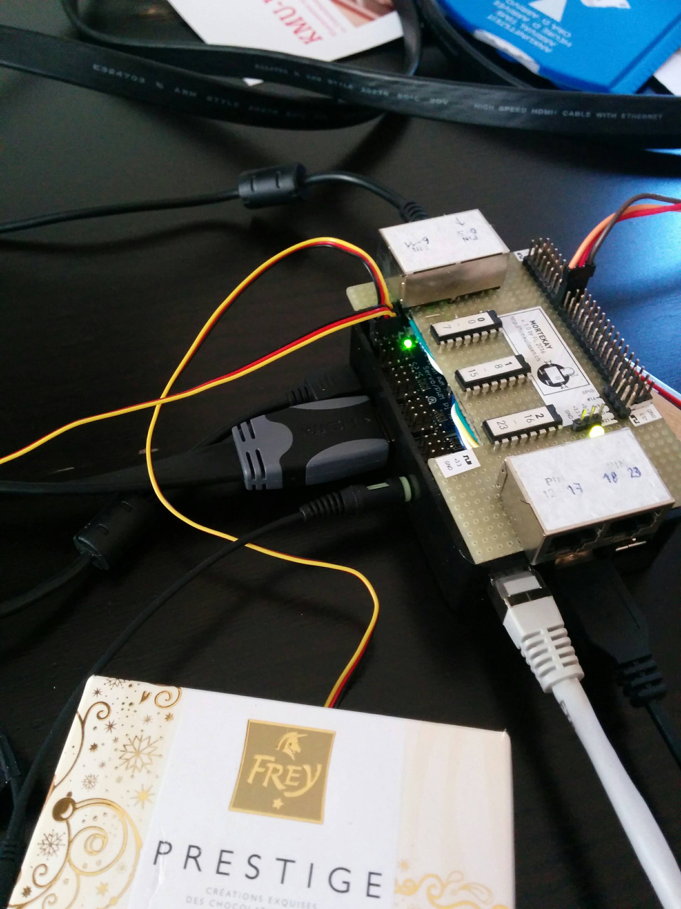
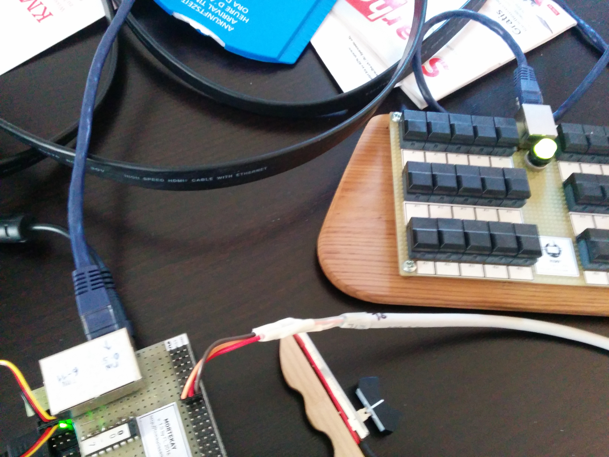

# Waldo and Rigby
1. [General Setup (using pi and waldo per SSH)](#general-setup-using-pi-and-waldo-per-ssh)
    - [Set fixed IP for raspberry pi](#set-fixed-ip-for-raspberry-pi)
    - [Set fixed IP for Laptop](#set-fixed-ip-for-laptop)
    - [Mount remote file system](#mount-remote-file-system)
    - [Raspberry Pi credentials](#easpberry-pi-credentials)
2. [Waldo commands](#waldo-commands)
    - [set_servo (recalibrate a servo)](#set_servo-recalibrate-a-servo)
        - [Requirements](#requirements)
        - [Steps](#steps)
    - [play (play an entire project)](#play-play-an-entire-project)
3. [Editor](#editor)
    - [remover / adder](#remover-adder)
    - [Convenience functions](#convenience-functions)
4. [Rigby (remote keyboard)](#rigby-remote-keyboard)
    - [Setup](#setup)
    - [(Re-)calibrate](#re-calibrate)
    - [Configure buttons](#configure-buttons)
5. [Setup as independent unit](#setup-as-independent-unit)
6. [Photos](#photos)


# General Setup (using pi and waldo per SSH)

## Set fixed IP for raspberry pi
1. Edit **/etc/dhcpcd.conf** , enable static ip config:
    ```
    interface eth0
    static ip_address=192.168.0.4/24
    static routers=192.168.0.1
    static domain_name_servers=192.168.0.1
    ```
2. reboot

## Set fixed IP for Laptop
```
ifconfig enp0s25 192.168.0.5 netmask 255.255.255.0 up
```

## Mount remote file system
```
$ mkdir  remote_waldo
$ sshfs pi@192.168.0.4:/home/pi/tmp_waldo_projects remote_waldo/
```

## Raspberry Pi credentials
pi / 1234


# Waldo commands

## set_servo (recalibrate a servo)
This functionality is used to store the settings of a certain servo (e.g., of a box) for a certain channel within a certain project.

### Requirements:
1. Potentiometer is connected to the topr-ow of connectors (labelled 0-23), on Pin 8.
2. Servo to calibrate is connected to bottom-row, to one of the pins.

### Steps
(Servo on Pin 2, Potentiometer on Pin 8)

```
$ python main.py -ss /path/to/project channelName
Set MCP3008 Pin [default 8] # this is the potentiometer, you can just hit enter
Set Servo Pin [default 0] # this is the servo pin, here use 2
Set minimum position: # hit &#39;m&#39; to set the value with the potentiometer
Set maximum position: # hit &#39;m&#39; to set the value with the potentiometer
Set start position: # usually use the minimum position to start closed
```

## play (play an entire project)
```
$ python main.py -p /path/to/project [start_offset_in_seconds]
```

Create a new project
1. Copy the folder from an existing project
2. Remove all channel files
3. Replace audio file in path/to/project/audio
4. Delete channels that are not needed anymore from the config file
5. Call set_servo for all channels if the servos are not calibrated
6. Record channels
    ```
    $ python main.py -r /path/to/project channelName
    ```


# Editor
```
$ python editor.py /path/to/project
```

## remover / adder
Switch between 'remover' and 'adder' mode.
* Adder (default after start of editor): clicking adds a point
* Remover: clicking removes the closest point

## Convenience functions
* Erase all: remove all added points from the editor.
* First/last to y = zero: changes the first and last point added by clicking to y = 0.
* add start/end: add a value at t = 0, and t = end_of_recording with y = 0 for both values.
* Save (needs to have channelName set in input field): write the new line to this channelName
* set same height (needs to have channelName set in input field): set last / first added point y value such, that they match the previously existing y value at that time.
* Merge (needs to have channelName set in input field): Merge the currently drawn line with the existing line (useful, if only a certain part of the curve needs to be changed).

# Rigby (remote keyboard)

## Setup
1. Connect rigby with RJ-45 cable to special port on pi ('pin 0-5')
2. Boot pi

## (Re-)calibrate
Needs to be done when the cable connecting rigby and the pi has changed.
1. Kill running waldo.py process
2. Calibrate:
    ```
    $ python waldo.py -cal
    ```

## Configure buttons
Button commands are stored in config file, the following config for example defines the first 10 buttons.  
Note the PROJECT_PATH on top: It gets ignored when the folder 'projects' in root exists - it will take 'projects' as Project path.

**Hint:** cancel must be button 30, due to special logic in the code,

```json
PROJECT_PATH: ~/waldo_projects
REC_REPL: false
button_value:
  0: 89
  1: 932
  2: 778
  3: 670
  4: 594
  5: 306
buttons:
  1: -p s1_tonleiter_einzaehlen
  2: -p s23_teaser_variante_tonleiter
  3: -p s12_refrain_piano
  4: -p s4_variante_solostimmen
  5: -p s9_variante_lalala
  6: -p reset
  7: -p reset
  8: -p reset
  9: -p reset
  10: -p reset
mcp:
  0:
    CLK: 4
    CS: 27
    MISO: 17
    MOSI: 18
  1:
    CLK: 22
    CS: 25
    MISO: 23
    MOSI: 24
  2:
    CLK: 5
    CS: 13
    MISO: 6
    MOSI: 12
```

# Setup as independent unit
Add the following script to the startup cycle of RasPi:
- autostart.py
It executes the following scripts:
- waldo.py (sets up all is needed for replay, record and analog buttons with MCP/Mortekai analog keyboard. Autoplay track '0')
- shutdown_button.py (displays 'ready' indicator LED (pin 16) and listens to pushbutton (pin 19) 
- numpad_listener.py
```
sudo nano /etc/rc.local
```
At the bottom, note the following:
```
# Run WALDO
sudo -u pi /home/pi/Scripts/waldo/autostart.sh
```

# Photos
  
^ Connecting the Potentiometer on Pin 8  

  
^ Connecting servos on (pin 0 and 1)  

  
^ Rigby (Ethernet on Pin 0-5)  
